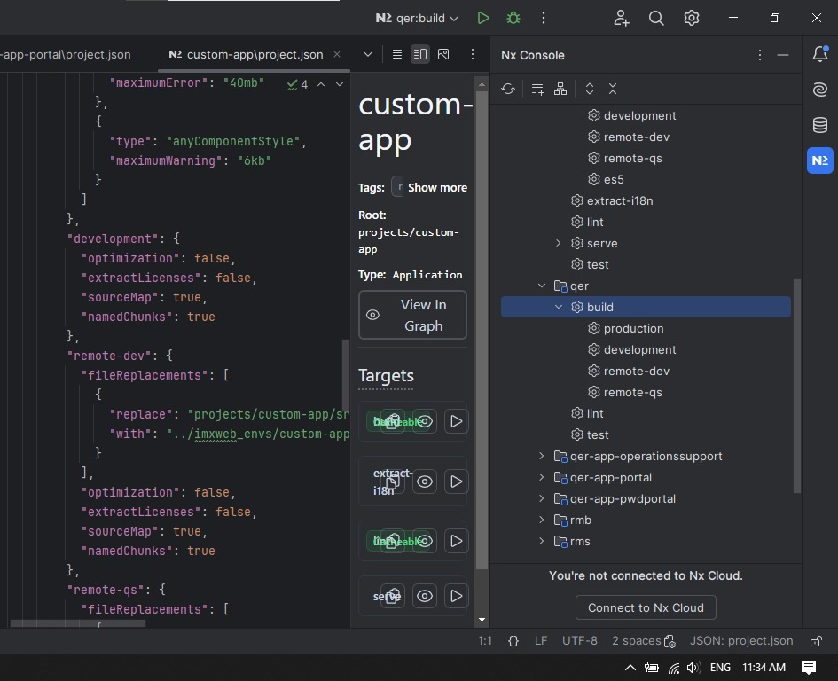
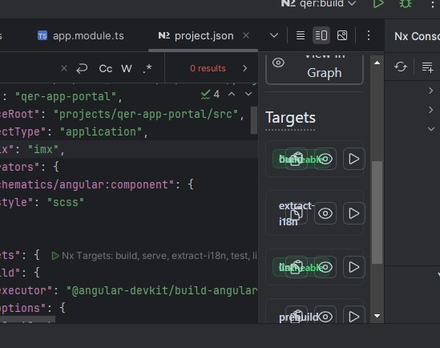

# UI Rendering Issue – IntelliJ IDEA Nx Console Plugin

This repository documents a **UI rendering bug** observed in the **Nx Console plugin** within **IntelliJ IDEA**, where the **"Targets" panel buttons** (e.g., `build`, `test`, `extract-i18n`, etc.) are **visually overlapping and misaligned**.

---

## 🐞 Bug Summary

- **Issue Type:** UI / Visual Bug
- **Affected Plugin:** Nx Console
- **Environment:** IntelliJ IDEA (JetBrains)
- **Affected Area:** Targets section UI layout
- **Discovered by:** [Jubair Rahman](https://www.linkedin.com/in/jubair-rahman/)

---

## 📸 Screenshots

| Overlapping Target Buttons | Misalignment of Icons |
|----------------------------|------------------------|
|  |  |


---

## 🔎 Bug Details

### ➤ Steps to Reproduce

1. Open an Nx monorepo project in **IntelliJ IDEA**.
2. Ensure the **Nx Console plugin** is installed and enabled.
3. Go to the **Nx Console side panel**.
4. Select any project and scroll to the **Targets** section.
5. Observe the layout of buttons (`enable`, `graph`, `run`) under each target.

---

### ➤ Actual Behavior

- Buttons within each target row **overlap visually**.
- Icons like `graph` and `run` are **not properly spaced**.
- Clicking becomes difficult due to visual clutter.

### ➤ Expected Behavior

- Buttons should be laid out in a **clean, horizontal or vertical format**.
- Each icon should have **sufficient spacing** for readability and usability.

---
## 🧪 QA Analysis

| Criteria      | Description                         |
|---------------|-------------------------------------|
| **Bug Type**  | UI / Layout / Visual Bug            |
| **Testing**   | UI Testing / Visual Regression      |
| **Severity**  | Medium                              |
| **Priority**  | High (affects usability & workflow) |
| **Impact**    | Reduces DX (Developer Experience)   |

---

## 🛠️ Possible Causes

- IntelliJ DPI scaling or font rendering conflicts.
- The plugin is not optimized for the IntelliJ layout.
- Theme or system-level UI overrides.

---

## ✅ Suggested Workarounds

- Try resizing the **Nx Console panel**.
- Reset zoom/font scaling via `Ctrl+0`.
- Use **VS Code** with Nx Console as an alternative.
- Report the issue to the plugin maintainers.

---

## 📬 Get Involved

If you face a similar issue, feel free to:
- Fork this repo and document your scenario.
- Report the bug on the [Nx Console GitHub](https://github.com/nrwl/nx-console/issues).
- Share this insight with your QA or frontend teams.

---
## 📁 Folder Structure

The repository follows this structure:

```bash
📁 UI-Rendering-Issue-IntelliJ-NxConsole
│
├── 📄 README.md
├── 📁 img
│   ├── overlap1.jpeg
│   ├── overlap2.jpeg
│   └── jubair_profile.jpg
├── 📁 test-docs
│   ├── test-plan.md
│   ├── test-cases.md
│   └── test-strategy.md
```
```yaml

- **README.md**: This file, which contains all relevant information about the bug, testing, and project structure.
- **img**: Folder containing screenshots and profile images.
- **test-docs**: Folder containing the test documentation, including the test plan, test cases, and test strategy.

---

```
## 📢 About the Author

# Jubair Rahman

**Software Engineer (QA) | HealthTech | Passionate about testing, tools, and UI quality.**

[](https://www.linkedin.com/in/jubair-rahman/) [](https://github.com/JubairRahman) [](https://wa.me/8801645763353)


---

> ✨ *"Quality is not only about catching bugs but about enhancing every user’s interaction — even for developers."*

